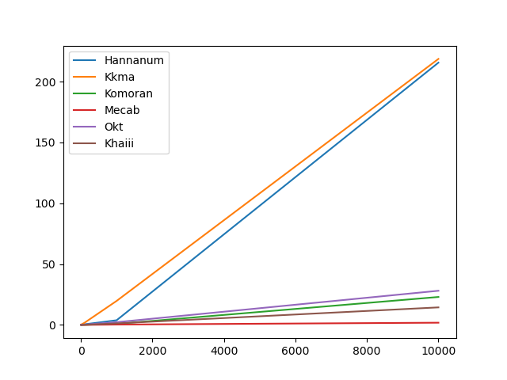
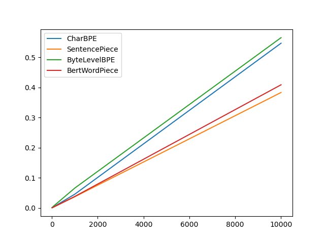

# Comparative Experiment on Tokenization Methods
* Environment : Ubuntu 18.04, Python 3.8.3
* Dataset : Korean Wikipedia

1) Morphology (형태소 분석)
* Package : KoNLPy (Hannanum, Kkma, Komoran, Mecab, Okt), Khaiii

* Example) 칙 코리아, 스티브 바이, 제프 벡등의 유명 음악가들과 연주한 바 있다.
    * Hannanum : 칙/코리아/스티브/바/이/,/제프/벡등/의/유명/음악가들/과/연주/하/ㄴ/바/있/다/.
    * Kkma : 칙/코리아/,/스티브/바이/,/저/의/프/벡등/의/유명/음악가/들/과/연주/하/ㄴ/바/있/다/.
    * Komoran : 칙 코리아/,/스티브 바이/제프 벡/등/의/유명/음악가/들/과/연주/하/ㄴ/바/있/다/.
    * Mecab : 칙/코리아/,/스티브/바이/,/제프/벡/등/의/유명/음악가/들/과/연주/한/바/있/다/.
    * Okt : 칙/코리아/, /스티브/바이/,/제프/벡등/의/유명/음악가/들/과/연주/한/바/있다/./\n
    * Khaiii : 칙/코리아/,/스티브/바이/,/제프/벡등/의/유명/음악가/들/과/연주/하/ㄴ/바/있/다/.

* Measure Tokenizer Loading Time
    Tokenizer | Hannanum | Kkma | Komoran | Mecab | Okt | Khaiii
    --------- | -------- | ---- | ------- | ----- | --- | ------
    Loading Time (sec) | 0.4185 | 0.0110 | 1.5994 | 0.0005 | 0.0041 | 0.0028  
    =>  **Mecab** < Khaiii < Okt < Kkma < Hannanum < Komoran

* Measuring Analyzing Time
    * Sampled 10, 100, 1000, 10000 sentences
      
=> **Mecab** < Khaiii < Komoran < Okt < Hannanum < Kkma 

2) Subword segmentation / Word-piece
* Package : Huggingface Tokenizers (https://github.com/huggingface/tokenizers)

* Example) 칙 코리아, 스티브 바이, 제프 벡등의 유명 음악가들과 연주한 바 있다.
    * CharBPE : 칙</w>/코/리아</w>/,</w>/스티/브</w>/바이</w>/,</w>/제프</w>/등의</w>/ 유명</w>/음악/가들과</w>/연주/한</w>/바</w>/있다</w>/.</w>
    * Byte level BPE : 칙/코/리아/,/스티/브/바이/,/제프/벡/등의/유명/음악가들과/연주/한/바/있다/./\n
    * BERT Wordpiece : 칙/코/##리아/,/스티/##브/바이/,/제프/[UNK]/유명/음악/##가/##들과/  연주/##한/바/있다/.
    * Sentencepiece : ▁칙/▁코/리아/, /▁스티/브/▁바/이/,/▁제프/▁등의/▁유명/▁음악/가/  들과/▁연주/한/▁바/▁있다.

* Measure Tokenizer Loading & Training Time
    Tokenizer | CharBPE | Byte level BPE | BERT Wordpiece | Sentencepiece
    --------- | -------- | ---- | ------- | -----
    Loading Time (sec) | 0.0001 | 0.0069 | 0.0073 | 0.0183 | 
    Training Time (sec) | 1.1387 | 1.9840 | 1.1990 | 1.4621

* Measuring Analyzing Time
    * Sampled 10, 100, 1000, 10000 sentences
      
=> **SentencePiece** < Bert WordPiece < CharBPE < ByteLevelBPE

reference : 
[https://iostream.tistory.com/144](https://iostream.tistory.com/144)
